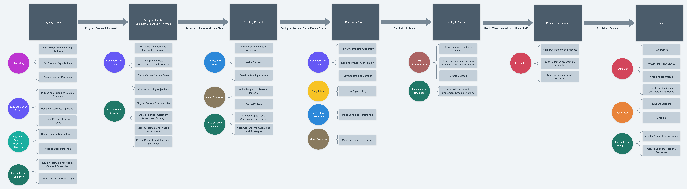

# Curriculum development process

## Program Ideation

At a cross-team level, **Marketing**, the **Learning Science Program Director**, and the **Lead Subject Matter Expert** are responsible for designing the overall program.

This team would aim to create:

* A Program Outline - [Example](https://whimsical.com/ata-timeline-CSVeGNzUwYh7uoGuuArmHT)
* A Marketing Plan
* Student Personas
* Course Competencies
* Instructional Model and Assessment Strategy

## Program Creation

Once the program has been designed and outlined, then a project team is created.

This project team contains **Instruction Designer**\(s\), **Curriculum Developer**\(s\), **Video Producer**\(s\), **Copy Editor**\(s\), and an **LMS Administrator**.

This consists of three phases: **Design**, **Content Creation**, and **Review.**

### Design

In the Design phase, the Subject Matter Expert and Instructional Designer will produce Module outline which includes:

* Concepts organized into Groupings
* Flow between Readings, Videos, Checkpoints, Activities, and an Assessment
* Learning Outcomes attached to concept groups

The Subject Matter Expert and Instruction Designer will work together to create the Learning Objectives of the Module.

### Content Creation

Once the Module outline has been created, then the Curriculum Developer will create the curriculum content.

A Video Producer can also begin creating Scripts and Video Outlines at this point.

The Instructional Designer will assist with guiding how the curriculum is teaching concepts.

### Content Review

Once the content has been completed, then it will be reviewed by the **Subject Matter Expert** and a **Copy Editor**.

They will directly make changes to fix typos, errors, or improve content delivery.

If any major changes are needed, then content will be pushed back to the Content Creation team.

Once content is reviewed, then it can be marked "DONE" and be ready for deployment to our LMS.

[Original Document](https://whimsical.com/content-development-plan-SJWKXYvV5gAHJdkbjYEYDg) in Whimsical:

