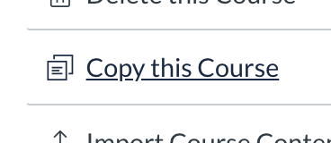
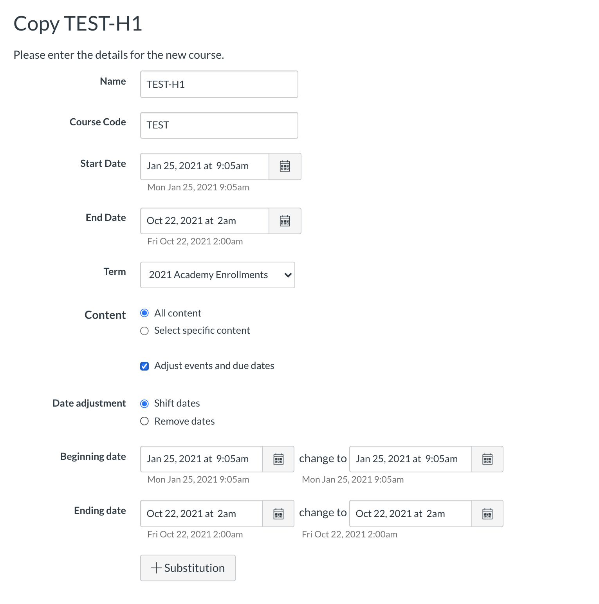
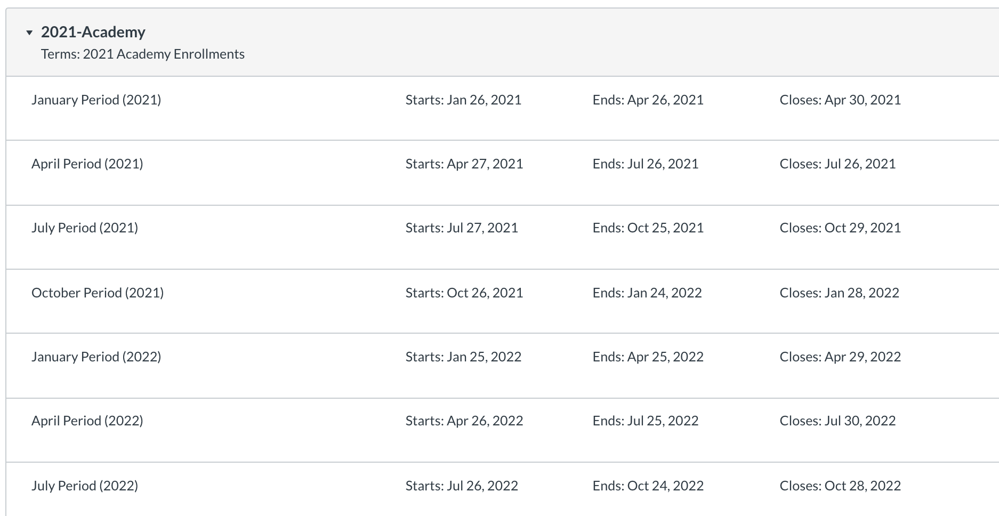

# Creating a New Course

Most Canvas Courses at Kenzie are created through duplication: we clone previous versions of  courses and implement improvements on a weekly basis.

"Copy this Course" exports course content and imports it to a new course.

### Settings: 

* **Name**: the full name of the course, visible on the course list and in e-mails.
* **Course** **Code**: the "breadcrumb" at the top of pages, and an encodable data field for Studio operations. We currently do not use the Course Code in a uniform way.
* **Start Date, End Date:** Set these dates accordingly, ensuring they match days of the week to the new period. This will ensure accurate date adjustment.
* **Term:** Academy enrollments use 13-week Grading Periods and are scheduled according to yearly academic terms. See **Terms and Grading Periods**, below.
*  **Adjust Events and Due Dates**: Usually this will be selected, as we rarely have two cohorts using two separate courses in the same time period. 
* **Date adjustment:** If a course is following a similar schedule, it may be useful to shift dates. If the schedule is sufficiently different \(or section designations will be different\), it may be more efficient to Remove due dates, and add them weekly instead.

## Terms and Grading Periods

Academy enrollments utilize grading periods, and a Term structure to support them. Because these 13-week quarters are regular, we are able to plan grading periods in advance and align them with quarterly academic operations.

* **Grading Periods:** There are 7 in a term, to accommodate any cohort enrolled in a given academic year. For example, a 12-month cohort enrolled in October will require three quarters from the next year.
* **Start date:** The first day of Orientation \(a Tuesday\).
* **End Date:** The last day before the next Orientation \(Monday\).
* **Close Date:** The Friday of the first week of the next grading period \(Friday of the next Orientation\). Grades are locked after this date.

This structure is important for partnerships and compliance.


Presently, Amazon CC cohorts have irregular start dates and do not utilize Grading Periods and Terms.


