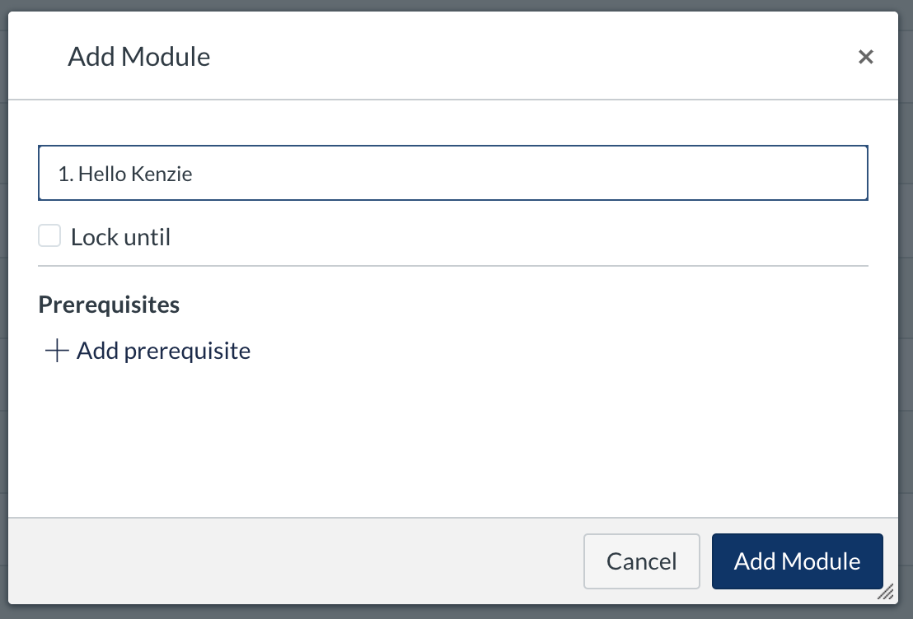
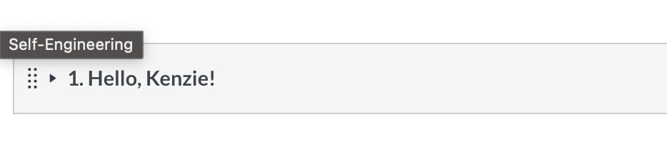
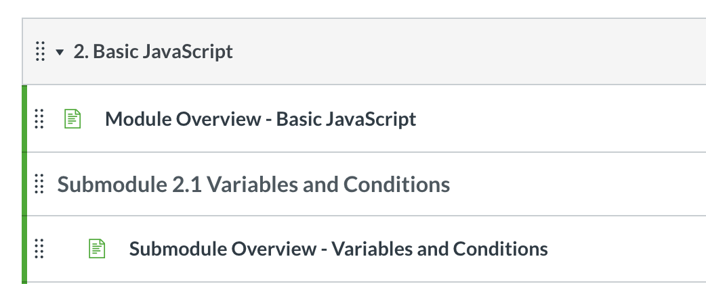

# Creating and Editing Modules

This section covers Module structure, including Submodule use, embedding content, and indentation.

## **Creating/Editing Modules**


* Create modules in MyKenzie by following the module outline listed in the main ****curriculum page \(ex. [Software Engineering 9-Month Curriculum](https://quizzical-brahmagupta-52e67a.netlify.app/curriculum/index.html)\). Include the module number at the beginning of the module title.

  


  

* **Add a module overview page to each module.**
  1. Create a Page inside the module.
  2. Title your Page "Overview: \[Module Name\]."
  3. Select "Don't Indent" for the Indentation.
  4. After creating the Page, drag it to the top of the module \(if it's not already there\).
  5. Click on the Page, then click "Edit".
  6. From within the Editor, click "HTML Editor" and add the HTML code block below.

     ```markup
     <iframe 
         style="width: 100%; 
         height: 1024px;" 
         src="<KURRICULUM_LINK_HERE>" 
         width="100%" 
         height="1024px" 
         allowfullscreen="allowfullscreen" 
         webkitallowfullscreen="webkitallowfullscreen" 
         mozallowfullscreen="mozallowfullscreen">
     </iframe>
     ```

  7. Replace `<KURRICULUM_LINK_HERE>` with the URL of the module overview page.   
     This can be derived from the development server by replacing the root of the URL from the development server \(`https://quizzical-brahmagupta-52e67a.netlify.app/`\) with the main curriculum server \(`https://kurriculum.kenzie.studio/`\)  
  
     Ex: `src="https://kurriculum.kenzie.studio/modules/Hello_Kenzie/Module_Overview/index.html"` 
* **Add Submodules**  
  Create "Submodules" by creating a Text Header inside the module. Title it with the submodule number followed by the name of the submodule. Select "Don't Indent" for the indentation.

* **Add the Submodule Overview Page to Each Submodule**  
  Just like you added the Module Overview, add the Submodule overview. Title should be "Overview: \[Submodule Name\]." This time, make sure to select "Indent 1 Level."

  Add Topics to the Submodules  


    

* **Create "Topics" by creating a Text Header.** Title it with the name of the topic. Select "Indent 1 Level" for the indentation.


Module Prerequisite settings can be added and removed at any time, without effecting grades.  
  
In the past, Prerequisites were used in combination with checkpoint quizzes to "gate" learners through content and check knowledge.



