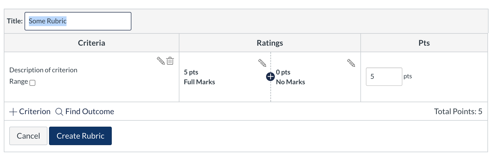

# Rubrics

## About Outcomes

Outcomes are defined in MyKenzie under ["Outcomes"](https://my.kenzie.academy/accounts/1/outcomes) for the organization "Kenzie Academy." Because outcomes should be shareable across courses, we store them at the organization-level, not the course-level.

## Importing Existing Kenzie Academy Outcomes

You can import existing groups of outcomes by doing the following:

1. Navigate to your course in MyKenzie
2. Click on "Outcomes"
3. Click "Find"
4. Navigate to "Account Standards" &gt; "Kenzie Academy" &gt; GroupName
5. To import an individual outcome, click the specific outcome. To import the whole group of outcomes, click the GroupName only so that no outcomes are selected.
6. Click Import

## Creating Rubrics

Determine whether you need a new rubric or a rubric that has already been created. Like Outcomes, rubrics can be pulled from other courses and re-used.  
  
**If you need a new rubric:** 

1. From the Assignment or from the Rubrics page in the canvas course, click '+ Add Rubric' or '+ Rubric' button. 

   

2. In most cases a rubric should use Outcomes that have already been created. Click 'Find Outcome' and search for the outcomes you need, adding them one by one to the rubric.
3. In the rubric options, select:

   * [x] Don't post Outcomes results to Learning Mastery Gradebook
   * [x] Use this rubric for assignment grading

   This ensures the rubric can be used to grade assignments and that the Learning Mastery Gradebook is not used.   
   Note: _While these are our defaults, there may be exceptions. the LMS Administrator should ensure rubric settings are correct._

4. Click 'Create Rubric' to create the rubric and attach it to the assignment. 
5. You will be prompted if there is a difference between the rubric points and the assignment settings: click 'Change' to set the the assignment's points to match the rubric.

**If you do not need a new rubric:**

In most cases rubrics are already pre-built and can be found in previous courses using the 'Find Rubric' button, in the '+ Add Rubric' tool above.

  
  

##  

